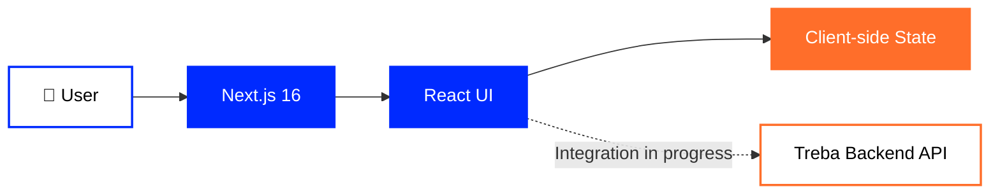

<div align="center">

# 🎨 Treba Frontend

### Next.js · React · TypeScript

Frontend application for the **Treba Marketplace**.

<br>

[](https://github.com/tr3ba)
[](https://treba.duckdns.org)
[](https://github.com/tr3ba/treba-backend)

<br><br>


</div>

---

## 👋 About

**Treba Frontend** is the web interface of the Treba Marketplace.

The application is built with **Next.js 16**, **React 19** and **TypeScript**
and provides the user-facing marketplace experience.

The frontend includes marketplace navigation, catalog presentation,
product-related UI, authentication interfaces and cart functionality.

Backend API integration is actively being developed.

---

## 🧩 Technology Stack

| Area | Technology |
|---|---|
| Framework | **Next.js 16.2.12** |
| UI | **React 19.2.4** |
| Language | **TypeScript 5.x** |
| Styling | **CSS** |
| Runtime | **Node.js 24** in Docker |
| Containers | **Docker** |
| CI/CD | **GitHub Actions** |
| Cloud delivery | **Amazon ECR · EC2 · Systems Manager** |

---

## 🎨 Frontend Stack

<div align="center">


<br><br>

**Next.js 16.2.12 · React 19.2.4 · TypeScript 5.x · CSS**

</div>

---

## 💻 Repository Languages

<div align="center">


</div>

---

## 🛍️ Marketplace UI

The frontend currently contains user-facing functionality for areas including:

- Marketplace catalog UI
- Product presentation
- Categories
- Navigation
- Authentication UI
- User state
- Shopping cart
- Responsive marketplace interface

---

## 🏗️ Current Architecture



---

## 🔌 Backend Integration Status

The Treba backend already provides a structured ASP.NET Core API.

The frontend integration is still being completed.

Current frontend modules for some major flows still use local client-side
implementations.

### Catalog

Product and category modules currently contain local demonstration data.

### Authentication

The current frontend authentication flow uses local client-side state.

### Cart

The cart is currently managed through frontend client-side state.

These implementations are development-stage functionality and are intended
to be replaced or connected to the Treba backend API.

---

## 🔐 Security Note

The current client-side authentication implementation is intended only for
development and demonstration.

Authentication logic that stores or validates credentials on the client
must **not** be treated as production authentication.

Production authentication should be handled by the Treba Backend API,
which already contains server-side authentication and authorization functionality.

---

## 📁 Relevant Project Areas

The repository includes frontend areas such as:

```text
src/
├── lib/
│   └── api/
│
└── context/
```

### `src/lib/api`

Contains frontend data/API modules, including product and category-related logic.

### `src/context`

Contains frontend application state such as authentication and cart state.

The repository also contains:

```text
docker/
└── Dockerfile.frontend

.github/
└── workflows/
```

---

## 🐳 Docker

The frontend repository contains:

```text
docker/Dockerfile.frontend
```

The Docker image uses **Node.js 24 Alpine**.

The containerized frontend is designed to run independently from the backend container.

---

## 🚀 CI/CD

The frontend repository contains a GitHub Actions deployment workflow.

The delivery path is:

```mermaid
flowchart LR

    GH["GitHub"]
    ACTIONS["GitHub Actions"]
    DOCKER["Docker Image"]
    ECR["Amazon ECR"]
    SSM["AWS Systems Manager"]
    EC2["Amazon EC2"]

    GH --> ACTIONS
    ACTIONS --> DOCKER
    DOCKER --> ECR
    ECR --> SSM
    SSM --> EC2

    style GH fill:#ffffff,color:#000000,stroke:#002AFF,stroke-width:2px
    style ACTIONS fill:#002AFF,color:#ffffff,stroke:#002AFF,stroke-width:2px
    style DOCKER fill:#002AFF,color:#ffffff,stroke:#002AFF,stroke-width:2px
    style ECR fill:#FF6E2A,color:#ffffff,stroke:#FF6E2A,stroke-width:2px
    style SSM fill:#FF6E2A,color:#ffffff,stroke:#FF6E2A,stroke-width:2px
    style EC2 fill:#FF6E2A,color:#ffffff,stroke:#FF6E2A,stroke-width:2px
```



The workflow supports Docker-based delivery through:

**GitHub Actions → Amazon ECR → AWS Systems Manager → Amazon EC2**

---

## 📊 Current Project Status

<div align="center">


</div>

### Implemented

- Next.js marketplace UI
- React component-based frontend
- TypeScript application
- Catalog presentation
- Authentication interface
- Cart interface
- Docker image
- AWS delivery workflow

### In Progress

- Product data integration with backend API
- Category data integration
- Server-side authentication integration
- Backend-powered cart
- Removal of temporary client-side demo data/state

---

## ⚙️ Development Configuration

Project dependency versions and scripts are defined in:

```text
package.json
```

The repository currently uses:

```text
Next.js 16.2.12
React 19.2.4
React DOM 19.2.4
TypeScript ^5
ESLint 9
```

---

## 📦 Related Repository

### ⚙️ Treba Backend

ASP.NET Core / .NET 10 backend API:

[](https://github.com/tr3ba/treba-backend)

---

<div align="center">

## Treba Marketplace

**Marketplace · Cloud Infrastructure · DevOps**

<br>

[](https://github.com/tr3ba)

</div>
